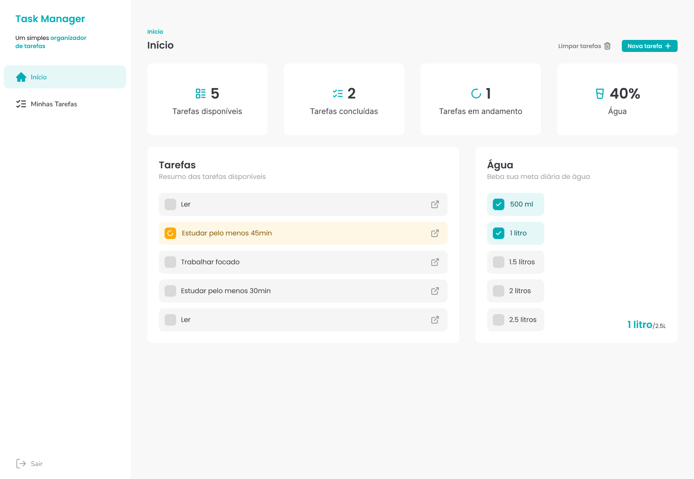
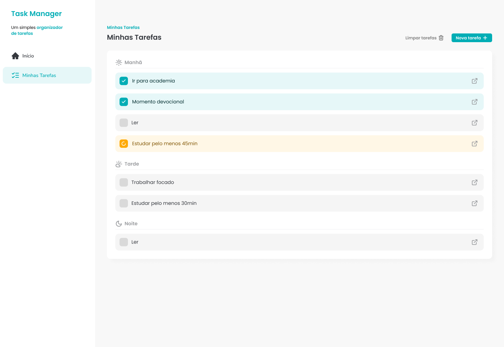
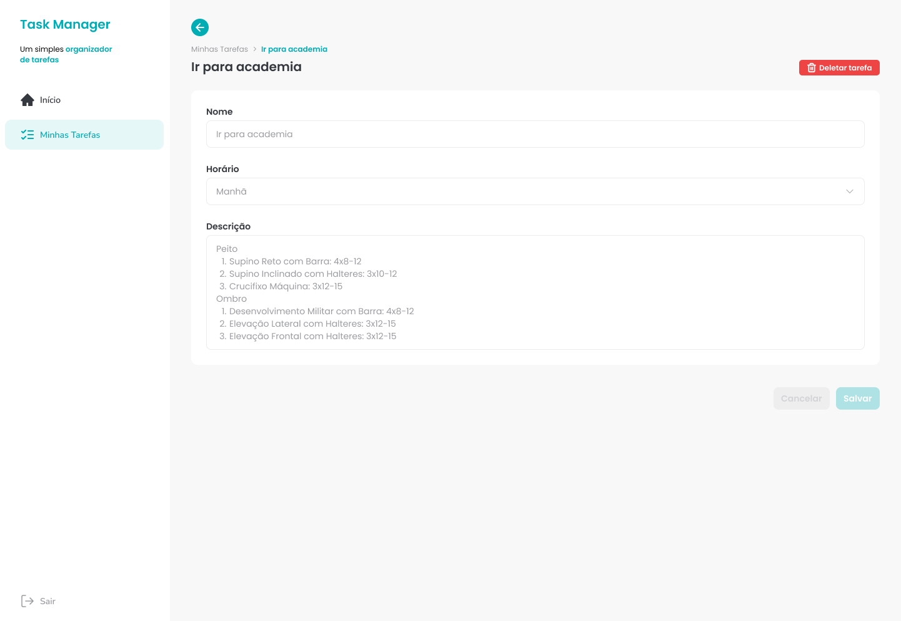

### React Super Task
* ReactJSX
* Json Server
* API
#### Padronizando código.

🧩 ESLint
    Padronizar e manter a qualidade do código
    Detectar e corrigir erros de estilo e boas práticas automaticamente

🎨 Prettier
    Padronizar a formatação do código (espaços, quebras de linha, aspas, etc.)
    Garantir consistência visual entre todos os arquivos do projeto

🧩 Husky

🎨 Saas vs 
    Emotion vs 
    usando TailWindCSS
    Styled Components vs 

🧩 TailWindCSS
https://tailwindcss.com/docs/installation/using-vite

#### Instando TailWindCSS
* 1. passo dependências
```
npm install tailwindcss @tailwindcss/vite
```

* 2 passo vite.config.ts
```
import { defineConfig } from 'vite'
import react from '@vitejs/plugin-react'
import tailwindcss from '@tailwindcss/vite'

// https://vite.dev/config/
export default defineConfig({
  plugins: [
    react(),
    tailwindcss(),
  ],
})
```

* 3 passo index.css
```
@import "tailwindcss";
```

* svg plugin
```
npm i -D vite-plugin-svgr
```
#### Vamos desenvolver Interfaces Incríveis.



